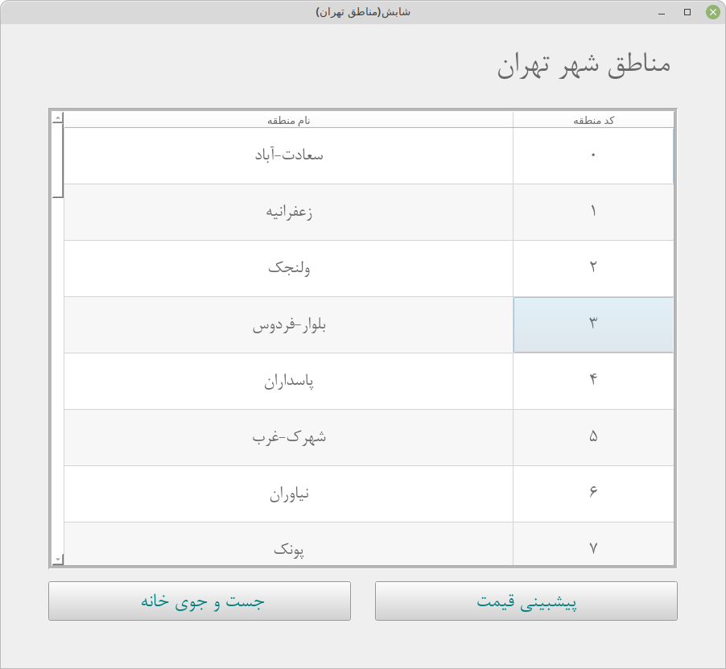
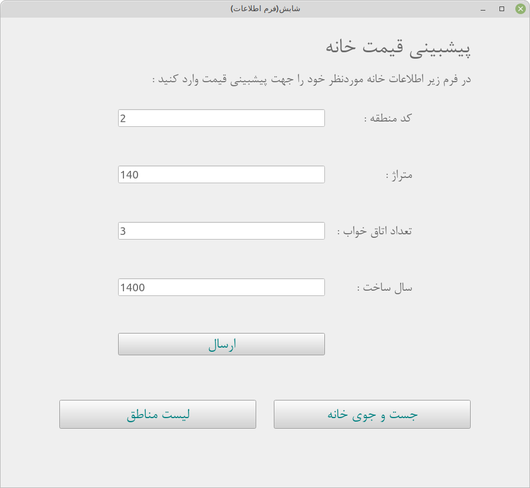
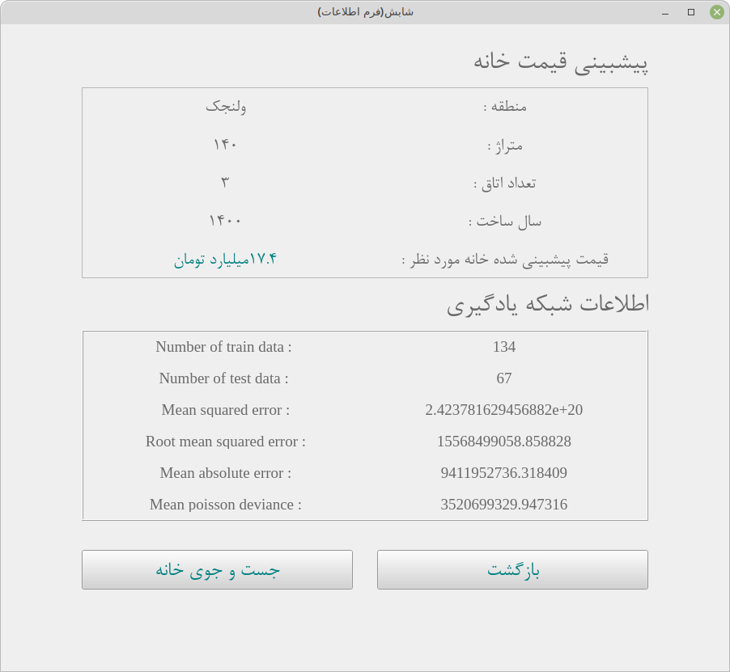
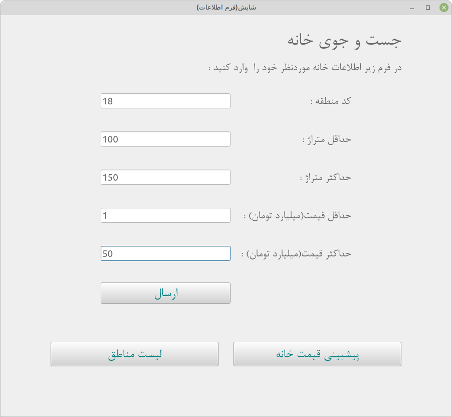
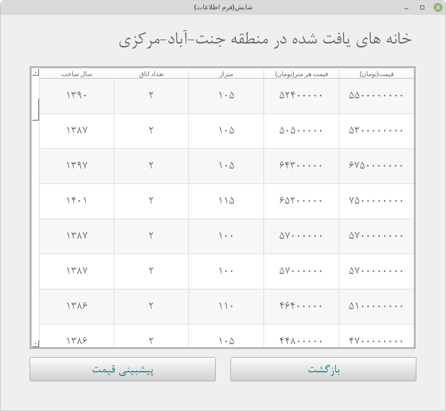

<h2>Goal:</h2>
In this repo, a graphical app has been created to predict house
price in Tehran city, based on user and "https://shabesh.com/"
website information.
This website is used for trading houses.  

<h2>How To Run?</h2>
1-Install python packages named in "requirements.txt". 
------> pip install -r requirements.txt 
2-Run "execute.py" file.

<h2>App Environment:</h2>

After running the "execute.py" file, a window is opened 
(called zone window) that shows 40 zones of Tehran city,
and each zone has a unique code: 

<h4>Prediction:</h4>
If the button "پیشبینی قیمت" is clicked in zone window,
a form window is opened: 
 

The form fields are: 
<ol>
    <li>zone code</li>
    <li>house area</li>
    <li>bedrooms</li>
    <li>year of construction</li>
</ol>
After submitting the form by client, the app uses 
the zone code to get information of houses for sale
on that zone from shabesh website using web scraping. 
Every house information includes:
<ol>
    <li>price</li>
    <li>price per meter</li>
    <li>area</li>
    <li>bedrooms</li>
    <li>Year of construction</li>
</ol>
After getting this information from website,
information is given to decision tree regressor
to train the learning network.
After the training is over, the client information
is given to the learning network for predicting the
price.Then the predicted price is shown: 
 
This window is also shows the learning network
information like training and testing data number,
mean squared error... 

<h4>search:</h4>
If the button "جست جوی خانه" is clicked in zone window,
a form window is opened: 
 
The form fields are: 
<ol>
    <li>zone code</li>
    <li>minimum area</li>
    <li>maximum area</li>
    <li>minimum price</li>
    <li>maximum price</li> 
</ol>
In this window, the client can specify the information
to search his/her desired house.This information determines
the limitation of price, limitation of area and the zone.

After submitting the form by client, the app uses
the zone code to get information of houses for sale
on that zone from shabesh website using web scraping.
Then the result is shown: 
 

<h2>Libraries:</h2>
<ol>
    <li>bs4: for web scraping</li>
    <li>requests: to get web pages</li>
    <li>PySide6: for GUI(based on QT)</li>
    <li>sklearn: for machine learning(using decision tree regression)</li>
    <li>re: for using regular expressions</li>
</ol>

